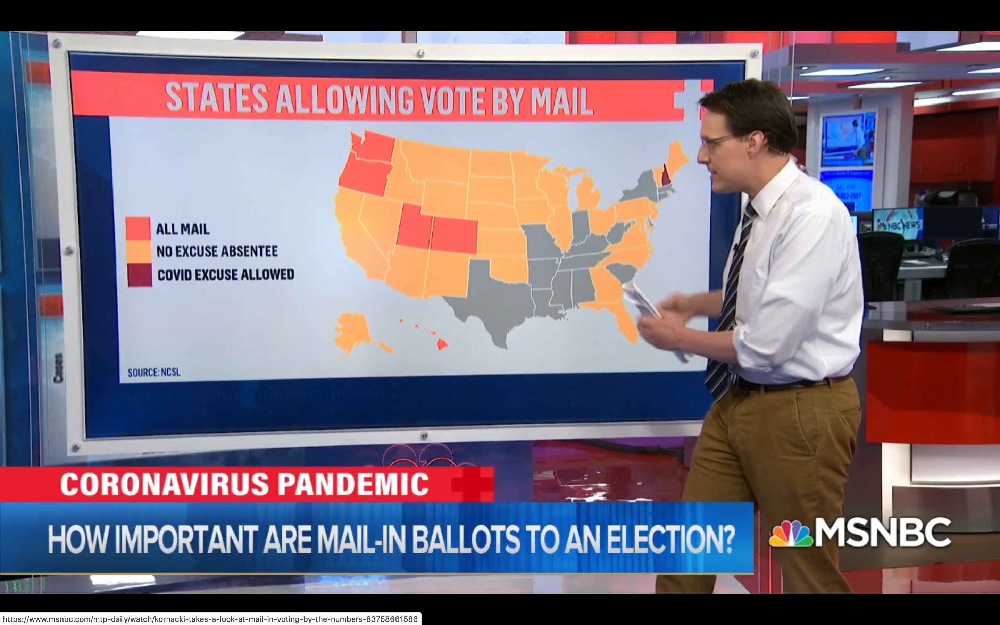

# Where can I vote by mail?

A super simple repository that tracks where Americans can (and can't)
vote by mail in the November 2020 general election.

## Map

[Courtesy of MSNBC](https://www.nbcnews.com/politics/2020-election/americans-may-not-know-who-won-presidency-or-senate-election-n1218266):

The good news is that no swing states (except Texas) forbid vote-by-mail.
The bad news is that many states have no experience running elections with
so much mail-in voting, so they may have trouble counting votes on Election
Night.

## Timeline

No updates yet.

## Contributing

If you get any new information or would like to beef up this repository,
please feel free to make a pull request.

If someone would like to turn the above map into a table, and perhaps cross-reference
with voting history and number of electoral votes, please help with that!
We hope this can become a useful resource for American voters.
